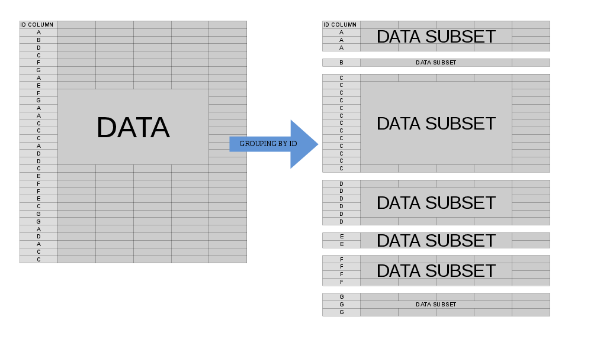

```{r, echo = FALSE, message = FALSE}
require(data.table)
knitr::opts_chunk$set(
  comment = "#",
  error = FALSE,
  tidy = FALSE,
  cache = FALSE,
  collapse = TRUE,
  out.width = '100%',
  dpi = 144
)
```

This vignette will explain the most common ways to use the `.SD` variable in your `data.table` analyses. It is an adaptation of [this answer](https://stackoverflow.com/a/47406952/3576984) given on StackOverflow.

# What is `.SD`?

In the broadest sense, `.SD` is just shorthand for capturing a variable that comes up frequently in the context of data analysis. It can be understood to stand for *S*ubset, *S*elfsame, or *S*elf-reference of the *D*ata. That is, `.SD` is in its most basic guise a _reflexive reference_ to the `data.table` itself -- as we'll see in examples below, this is particularly helpful for chaining together "queries" (extractions/subsets/etc using `[`). In particular, this also means that `.SD` is _itself a `data.table`_ (with the caveat that it does not allow assignment with `:=`).

The simpler usage of `.SD` is for column subsetting (i.e., when `.SDcols` is specified); as this version is much more straightforward to understand, we'll cover that first below. The interpretation of `.SD` in its second usage, grouping scenarios (i.e., when `by = ` or `keyby = ` is specified), is slightly different, conceptually (though at core it's the same, since, after all, a non-grouped operation is an edge case of grouping with just one group).

## Loading and Previewing Lahman Data

To give this a more real-world feel, rather than making up data, let's load some data sets about baseball from the [Lahman database](https://www.seanlahman.com/baseball-archive/statistics/). In typical R usage, we'd simply load these data sets from the `Lahman` R package; in this vignette, we've pre-downloaded them directly from the package's GitHub page instead.

```{r download_lahman}
load('Teams.RData')
setDT(Teams)
Teams

load('Pitching.RData')
setDT(Pitching)
Pitching
```

Readers up on baseball lingo should find the tables' contents familiar; `Teams` records some statistics for a given team in a given year, while `Pitching` records statistics for a given pitcher in a given year. Please do check out the [documentation](https://www.seanlahman.com/files/database/readme2017.txt) and explore the data yourself a bit before proceeding to familiarize yourself with their structure.

# `.SD` on Ungrouped Data

To illustrate what I mean about the reflexive nature of `.SD`, consider its most banal usage:

```{r plain_sd}
Pitching[ , .SD]
```

That is, `Pitching[ , .SD]` has simply returned the whole table, i.e., this was an overly verbose way of writing `Pitching` or `Pitching[]`:

```{r plain_sd_is_table}
identical(Pitching, Pitching[ , .SD])
```

In terms of subsetting, `.SD` is still a subset of the data, it's just a trivial one (the set itself).

## Column Subsetting: `.SDcols`

The first way to impact what `.SD` is is to limit the _columns_ contained in `.SD` using the `.SDcols` argument to `[`:

```{r simple_sdcols}
# W: Wins; L: Losses; G: Games
Pitching[ , .SD, .SDcols = c('W', 'L', 'G')]
```

This is just for illustration and was pretty boring. But even this simply usage lends itself to a wide variety of highly beneficial / ubiquitous data manipulation operations:

## Column Type Conversion

Column type conversion is a fact of life for data munging. Though [`fwrite` recently gained the ability to declare the class of each column up front](https://github.com/Rdatatable/data.table/pull/2545), not all data sets come from `fread` (e.g. in this vignette) and conversions back and forth among `character`/`factor`/`numeric` types are common. We can use `.SD` and `.SDcols` to batch-convert groups of columns to a common type.

We notice that the following columns are stored as `character` in the `Teams` data set, but might more logically be stored as `factor`s:

```{r identify_factors}
# teamIDBR: Team ID used by Baseball Reference website
# teamIDlahman45: Team ID used in Lahman database version 4.5
# teamIDretro: Team ID used by Retrosheet
fkt = c('teamIDBR', 'teamIDlahman45', 'teamIDretro')
# confirm that they're stored as `character`
Teams[ , sapply(.SD, is.character), .SDcols = fkt]
```

If you're confused by the use of `sapply` here, note that it's quite similar for base R `data.frames`:

```{r identify_factors_as_df}
setDF(Teams) # convert to data.frame for illustration
sapply(Teams[ , fkt], is.character)
setDT(Teams) # convert back to data.table
```

The key to understanding this syntax is to recall that a `data.table` (as well as a `data.frame`) can be considered as a `list` where each element is a column -- thus, `sapply`/`lapply` applies the `FUN` argument (in this case, `is.character`) to each _column_ and returns the result as `sapply`/`lapply` usually would.

The syntax to now convert these columns to `factor` is very similar -- simply add the `:=` assignment operator:

```{r assign_factors}
Teams[ , (fkt) := lapply(.SD, factor), .SDcols = fkt]
# print out the first column to demonstrate success
head(unique(Teams[[fkt[1L]]]))
```

Note that we must wrap `fkt` in parentheses `()` to force `data.table` to interpret this as column names, instead of trying to assign a column named `'fkt'`.

Actually, the `.SDcols` argument is quite flexible; above, we supplied a `character` vector of column names. In other situations, it is more convenient to supply an `integer` vector of column _positions_ or a `logical` vector dictating include/exclude for each column. `.SDcols` even accepts regular expression-based pattern matching.

For example, we could do the following to convert all `factor` columns to `character`:

```{r sd_as_logical}
# while .SDcols accepts a logical vector,
#   := does not, so we need to convert to column
#   positions with which()
fkt_idx = which(sapply(Teams, is.factor))
Teams[ , (fkt_idx) := lapply(.SD, as.character), .SDcols = fkt_idx]
head(unique(Teams[[fkt_idx[1L]]]))
```

Lastly, we can do pattern-based matching of columns in `.SDcols` to select all columns which contain `team` back to `factor`:

```{r sd_patterns}
Teams[ , .SD, .SDcols = patterns('team')]

# now convert these columns to factor;
#   value = TRUE in grep() is for the LHS of := to
#   get column names instead of positions
team_idx = grep('team', names(Teams), value = TRUE)
Teams[ , (team_idx) := lapply(.SD, factor), .SDcols = team_idx]
```

** A proviso to the above: _explicitly_ using column numbers (like `DT[ , (1) := rnorm(.N)]`) is bad practice and can lead to silently corrupted code over time if column positions change. Even implicitly using numbers can be dangerous if we don't keep smart/strict control over the ordering of when we create the numbered index and when we use it.

## Controlling a Model's Right-Hand Side

Varying model specification is a core feature of robust statistical analysis. Let's try and predict a pitcher's ERA (Earned Runs Average, a measure of performance) using the small set of covariates available in the `Pitching` table. How does the (linear) relationship between `W` (wins) and `ERA` vary depending on which other covariates are included in the specification?

Here's a short script leveraging the power of `.SD` which explores this question:

```{r sd_for_lm, cache = FALSE}
# this generates a list of the 2^k possible extra variables
#   for models of the form ERA ~ G + (...)
extra_var = c('yearID', 'teamID', 'G', 'L')
models = unlist(
  lapply(0L:length(extra_var), combn, x = extra_var, simplify = FALSE),
  recursive = FALSE
)

# here are 16 visually distinct colors, taken from the list of 20 here:
#   https://sashat.me/2017/01/11/list-of-20-simple-distinct-colors/
col16 = c('#e6194b', '#3cb44b', '#ffe119', '#0082c8',
          '#f58231', '#911eb4', '#46f0f0', '#f032e6',
          '#d2f53c', '#fabebe', '#008080', '#e6beff',
          '#aa6e28', '#fffac8', '#800000', '#aaffc3')

par(oma = c(2, 0, 0, 0))
lm_coef = sapply(models, function(rhs) {
  # using ERA ~ . and data = .SD, then varying which
  #   columns are included in .SD allows us to perform this
  #   iteration over 16 models succinctly.
  #   coef(.)['W'] extracts the W coefficient from each model fit
  Pitching[ , coef(lm(ERA ~ ., data = .SD))['W'], .SDcols = c('W', rhs)]
})
barplot(lm_coef, names.arg = sapply(models, paste, collapse = '/'),
        main = 'Wins Coefficient\nWith Various Covariates',
        col = col16, las = 2L, cex.names = .8)
```

The coefficient always has the expected sign (better pitchers tend to have more wins and fewer runs allowed), but the magnitude can vary substantially depending on what else we control for.

## Conditional Joins

`data.table` syntax is beautiful for its simplicity and robustness. The syntax `x[i]` flexibly handles three common approaches to subsetting -- when `i` is a `logical` vector, `x[i]` will return those rows of `x` corresponding to where `i` is `TRUE`; when `i` is _another `data.table`_ (or a `list`), a (right) `join` is performed (in the plain form, using the `key`s of `x` and `i`, otherwise, when `on = ` is specified, using matches of those columns); and when `i` is a character, it is interpreted as shorthand for `x[list(i)]`, i.e., as a join.

This is great in general, but falls short when we wish to perform a _conditional join_, wherein the exact nature of the relationship among tables depends on some characteristics of the rows in one or more columns.

This example is admittedly a tad contrived, but illustrates the idea; see here ([1](https://stackoverflow.com/questions/31329939/conditional-keyed-join-update-and-update-a-flag-column-for-matches), [2](https://stackoverflow.com/questions/29658627/conditional-binary-join-and-update-by-reference-using-the-data-table-package)) for more.

The goal is to add a column `team_performance` to the `Pitching` table that records the team's performance (rank) of the best pitcher on each team (as measured by the lowest ERA, among pitchers with at least 6 recorded games).

```{r conditional_join}
# to exclude pitchers with exceptional performance in a few games,
#   subset first; then define rank of pitchers within their team each year
#   (in general, we should put more care into the 'ties.method' of frank)
Pitching[G > 5, rank_in_team := frank(ERA), by = .(teamID, yearID)]
Pitching[rank_in_team == 1, team_performance :=
           Teams[.SD, Rank, on = c('teamID', 'yearID')]]
```

Note that the `x[y]` syntax returns `nrow(y)` values (i.e., it's a right join), which is why `.SD` is on the right in `Teams[.SD]` (since the RHS of `:=` in this case requires `nrow(Pitching[rank_in_team == 1])` values.

# Grouped `.SD` operations

Often, we'd like to perform some operation on our data _at the group level_. When we specify `by =` (or `keyby = `), the mental model for what happens when `data.table` processes `j` is to think of your `data.table` as being split into many component sub-`data.table`s, each of which corresponds to a single value of your `by` variable(s):

```{r grouping_png, fig.cap = "Grouping, Illustrated", echo = FALSE}

```

In the case of grouping, `.SD` is multiple in nature -- it refers to _each_ of these sub-`data.table`s, _one-at-a-time_ (slightly more accurately, the scope of `.SD` is a single sub-`data.table`). This allows us to concisely express an operation that we'd like to perform on _each sub-`data.table`_ before the re-assembled result is returned to us.

This is useful in a variety of settings, the most common of which are presented here:

## Group Subsetting

Let's get the most recent season of data for each team in the Lahman data. This can be done quite simply with:

```{r group_sd_last}
# the data is already sorted by year; if it weren't
#   we could do Teams[order(yearID), .SD[.N], by = teamID]
Teams[ , .SD[.N], by = teamID]
```

Recall that `.SD` is itself a `data.table`, and that `.N` refers to the total number of rows in a group (it's equal to `nrow(.SD)` within each group), so `.SD[.N]` returns the _entirety of `.SD`_ for the final row associated with each `teamID`.

Another common version of this is to use `.SD[1L]` instead to get the _first_ observation for each group, or `.SD[sample(.N, 1L)]` to return a _random_ row for each group.

## Group Optima

Suppose we wanted to return the _best_ year for each team, as measured by their total number of runs scored (`R`; we could easily adjust this to refer to other metrics, of course). Instead of taking a _fixed_ element from each sub-`data.table`, we now define the desired index _dynamically_ as follows:

```{r sd_team_best_year}
Teams[ , .SD[which.max(R)], by = teamID]
```

Note that this approach can of course be combined with `.SDcols` to return only portions of the `data.table` for each `.SD` (with the caveat that `.SDcols` should be fixed across the various subsets)

_NB_: `.SD[1L]` is currently optimized by [_`GForce`_](https://Rdatatable.gitlab.io/data.table/library/data.table/html/datatable-optimize.html) ([see also](https://stackoverflow.com/questions/22137591/about-gforce-in-data-table-1-9-2)), `data.table` internals which massively speed up the most common grouped operations like `sum` or `mean` -- see `?GForce` for more details and keep an eye on/voice support for feature improvement requests for updates on this front: [1](https://github.com/Rdatatable/data.table/issues/735), [2](https://github.com/Rdatatable/data.table/issues/2778), [3](https://github.com/Rdatatable/data.table/issues/523), [4](https://github.com/Rdatatable/data.table/issues/971), [5](https://github.com/Rdatatable/data.table/issues/1197), [6](https://github.com/Rdatatable/data.table/issues/1414)

## Grouped Regression

Returning to the inquiry above regarding the relationship between `ERA` and `W`, suppose we expect this relationship to differ by team (i.e., there's a different slope for each team). We can easily re-run this regression to explore the heterogeneity in this relationship as follows (noting that the standard errors from this approach are generally incorrect -- the specification `ERA ~ W*teamID` will be better -- this approach is easier to read and the _coefficients_ are OK):

```{r group_lm, results = 'hide'}
# Overall coefficient for comparison
overall_coef = Pitching[ , coef(lm(ERA ~ W))['W']]
# use the .N > 20 filter to exclude teams with few observations
Pitching[ , if (.N > 20L) .(w_coef = coef(lm(ERA ~ W))['W']), by = teamID
          ][ , hist(w_coef, 20L, las = 1L,
                    xlab = 'Fitted Coefficient on W',
                    ylab = 'Number of Teams', col = 'darkgreen',
                    main = 'Team-Level Distribution\nWin Coefficients on ERA')]
abline(v = overall_coef, lty = 2L, col = 'red')
```

While there is indeed a fair amount of heterogeneity, there's a distinct concentration around the observed overall value.

The above is just a short introduction of the power of `.SD` in facilitating beautiful, efficient code in `data.table`!
